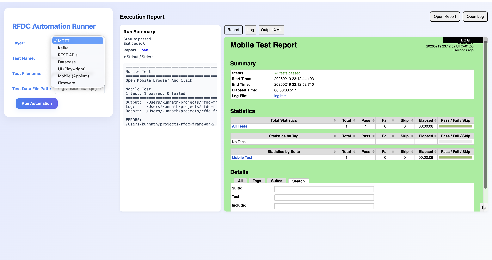

RFDC Framework



RFDC is a modular Robot Framework-based automation platform focused on device and cloud integrations. It provides reusable custom libraries, sample suites, and an AI-based MCP (Model Context Protocol) server to assist with test intent interpretation, self-healing, and remediation suggestions. The project is designed to integrate into CI/CD pipelines (GitHub Actions, GitLab CI, Jenkins).

**Components:**

- **Libraries:** Custom Robot Framework libraries for DB, MQTT, Kafka, REST, Firmware, UI (Playwright), and Mobile (Appium) located in the `libraries/` folder.
- **Tests:** Example Robot Framework suites in `tests/` exercising each domain.
- **MCP Server:** AI layer in `mcp-server/` for interpreting high-level test intents and providing recommendations.
- **Frontend / Backend:** Small UI and API server under `frontend/` and `backend/` for viewing reports and interacting with MCP features.

**Directory Layout:**
- `libraries/` — custom library modules
- `tests/` — Robot test suites and data
- `mcp-server/` — AI server and integration scripts
- `frontend/`, `backend/` — optional UI and API server components
- `scripts/` — helper scripts to setup envs and run tests

Getting started (quick):

Prerequisites:
- Python 3.8+ and pip
- Robot Framework and common libs (see `requirements.txt`)
- Node.js (for frontend) if using the web UI
- Android SDK + emulator (for mobile tests) when needed

Quick setup:

1. Create and activate a virtual environment:

```bash
python3 -m venv .venv
source .venv/bin/activate
```

2. Install Python dependencies:

```bash
pip install -r requirements.txt
```

3. (Optional) Install frontend dependencies and start the UI:

```bash
cd frontend
npm install
npm start
```

4. Start the MCP server (development):

```bash
python -m mcp-server.main
```

5. Run example Robot tests (sample):

```bash
# run a single suite
bash scripts/run_robot.sh tests/rest_test.robot

# run all sample suites
bash scripts/run_robot.sh
```

Notes and next steps:
- Extend or replace libraries in `libraries/` with your implementations.
- Configure CI/CD workflows in `.github/` or `.ci/` to run test suites and publish reports.
- The MCP server is a skeleton; add model integrations or AI logic under `mcp-server/` for intent parsing and self-healing flows.

Roadmap:
- Implement full-featured custom libraries
- Harden and document the MCP integrations
- Add CI/CD pipelines and example workflows

For developer notes and longer documentation see `PROJECT_DOC.md` and `copilot-instructions.md`.


 /Users/kunnath/Android/Sdk/emulator/emulator -avd rfdc_avd

 appium -p 4725
